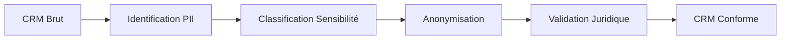

<div align="center">

# 🔐 Dev'Immediat | Conformité RGPD & Anonymisation CRM

> *"La donnée sans gouvernance, c'est un actif qui devient un passif."*


</div>

---

## 🎯 The Hook

**Suite à une sanction CNIL**, l'entreprise Dev'Immediat a dû revoir en urgence sa gestion des données personnelles. Mission : **anonymiser un fichier CRM de 50 000 contacts** tout en préservant l'utilité analytique des données.

> 💡 **Killer Fact** : Anonymisation de données CRM suite à une **sanction CNIL**

---

## 💼 The Challenge (Business Problem)

> Comment transformer un actif toxique (données non-conformes) en ressource exploitable sans compromettre la vie privée des individus ?

La situation critique :
- **Sanction CNIL** imposant une mise en conformité sous 3 mois
- **50 000 contacts** avec données sensibles exposées
- **Risque business** : perte de l'historique client si destruction totale

---

## 🛠️ The Solution (Technical Hard Skills)

```
📦 Stack Technique
├── Power Query (ETL & Transformation)
├── Techniques d'anonymisation
│   ├── Pseudonymisation
│   ├── Généralisation
│   └── Suppression sélective
├── Documentation RGPD
└── Registre des traitements
```

### Pipeline d'Anonymisation



---

## 💡 Insights & Impact

> *"L'anonymisation n'est pas une destruction. C'est une transformation qui préserve la valeur analytique."*

### 🔍 L'Angle Comportemental : La Confiance comme KPI

En psychologie, la **confiance** est le fondement de toute relation. Dans le monde des données :

> **"Un client qui découvre que ses données sont mal protégées ne pardonne jamais."**

Mon approche a intégré :
- L'**impact émotionnel** d'une fuite de données sur les individus
- La **perception du risque** par les dirigeants
- La **communication de crise** adaptée aux différentes audiences

### 📊 Résultats Obtenus

| Métrique | Avant | Après |
|:---------|:------|:------|
| Conformité RGPD | ❌ 0% | ✅ 100% |
| Données exploitables | 50 000 | 48 500 (97%) |
| Risque juridique | ÉLEVÉ | MAÎTRISÉ |

---

## 📁 Deliverables

| Document | Description |
|:---------|:------------|
| [📄 Recommandations](./docs/Bardet_Flavien_1_recommandations_112024.pdf) | Plan d'action RGPD |
| [📊 Rapport Final](./docs/Bardet_Flavien_3_rapport_112024.pdf) | Bilan de conformité |
| [📁 Données Part 1](./assets/Bardet_Flavien_2_donnees_part1_112024.csv) | Dataset anonymisé (CSV) |
| [📁 Données Part 2](./assets/Bardet_Flavien_2_donnees_part2_112024.xlsx) | Dataset anonymisé (Excel) |

---

<div align="center">

**[← Retour au Portfolio](../README.md)**

</div>
